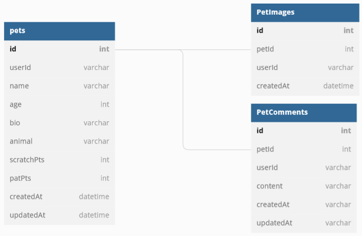
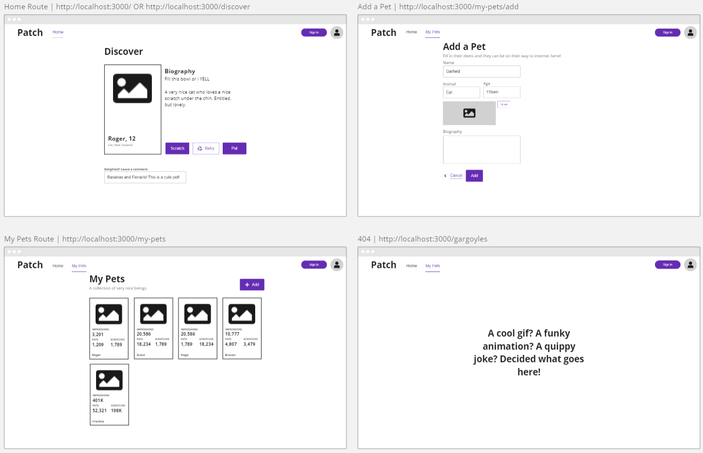

# Patch

Welcome to Patch (pat or scratch), an interactive web application that is geared towards pet lovers. Initially, it will start out an application, but it's ready to become the social media platform for pets...

## Getting Started 🐶

This repository uses [TailwindCSS](https://tailwindcss.com/) for styling. For the best developer experience, install the [TailwindCSS IntelliSense](https://marketplace.visualstudio.com/items?itemName=bradlc.vscode-tailwindcss) extension for VSCode.

### Frontend:

- [React](https://beta.reactjs.org/)
- [TailwindCSS](https://tailwindcss.com/)
- [React Router](https://reactrouter.com/)
- [Vite](https://vitejs.dev/)
- [Redux](https://redux.js.org/)

### Backend:

- [Express](https://expressjs.com/)
- [Knex](http://knexjs.org/)
- [PostgreSQL](https://www.postgresql.org/) # for deployment
- [SQLite3](https://www.sqlite.org/index.html) # for development

### Testing:

- [React Testing Library](https://testing-library.com/docs/react-testing-library/intro/)
- [Vitest](https://vitest.dev/)
- [nock](https://github.com/nock/nock)
- [supertest](https://github.com/visionmedia/supertest)

## Contributing Guide 🐱

To run this project:

```sh
# clone to your local machine
cd patch
npm install
npm run db:reset # will run migrations and seeds
npm run dev

# you can find the server running on http://localhost:3000
```

To preview what a production build would look like:

```sh
npm run preview # this builds the client and serves it
                # statically from the Express server
```

**NOTE**: Only do this when you want to view the staging build, use `npm run dev` for development.

## Sharing HMR over liveshare 🙀

To share Hot Module Replacement (HMR) with your pair over liveshare, ensure that you are sharing both port 3000 and 3001. This is because vite's websocket server runs on port 3001.

## About the Project 😻

### DB Schema (for now)



### Wireframes

Wireframes live on a Miro Board, here's a quick snapshot of what they look like, but check in Discord for the link!



## API Routes

### GET /api/v1/pets/random

Response:

```js
pet: {
  id: 1,
  name: "Bella",
  age: 2,
  animal: "dog",
  bio: "Bella is a sweet dog who loves to play fetch",
  image_url: "https://images.unsplash.com/photo-1608744882201-52a7f7f3dd60?ixlib=rb-1.2.1&ixid=MnwxMjA3fDB8MHxwaG90by1wYWdlfHx8fGVufDB8fHx8&auto=format&fit=crop&w=872&q=80",
}
```

---

### GET /api/v1/pets/my

_Note: Requires authentication_

Response:

```js
pets: [
  {
    id: 1,
    name: 'Bella',
    age: 2,
    animal: 'dog',
    bio: 'Bella is a sweet dog who loves to play fetch',
    image_url:
      'https://images.unsplash.com/photo-1608744882201-52a7f7f3dd60?ixlib=rb-1.2.1&ixid=MnwxMjA3fDB8MHxwaG90by1wYWdlfHx8fGVufDB8fHx8&auto=format&fit=crop&w=872&q=80',
    scratchPoints: 11987,
    patPoints: 7632,
    impressions: 21983,
    created_at: '2021-01-01T00:00:00.000Z',
    updated_at: '2021-01-01T00:00:00.000Z',
  },
  {
    id: 1,
    name: 'Charlotte',
    age: 4,
    animal: 'cat',
    bio: 'A creature of darkness, she will eat your food, and then you',
    image_url:
      'https://images.unsplash.com/photo-1592194996308-7b43878e84a6?ixlib=rb-1.2.1&ixid=MnwxMjA3fDB8MHxwaG90by1wYWdlfHx8fGVufDB8fHx8&auto=format&fit=crop&w=774&q=80',
    scratchPoints: 32321,
    patPoints: 5,
    impressions: 32326,
    created_at: '2021-01-01T00:00:00.000Z',
    updated_at: '2021-01-01T00:00:00.000Z',
  },
]
```

---

### POST /api/v1/pets/my

_Note: Requires authentication_

Request:

```js
{
  name: "Bella",
  age: 2,
  animal: "dog",
  bio: "Bella is a sweet dog who loves to play fetch",
  image_url: "https://images.unsplash.com/photo-1608744882201-52a7f7f3dd60?ixlib=rb-1.2.1&ixid=MnwxMjA3fDB8MHxwaG90by1wYWdlfHx8fGVufDB8fHx8&auto=format&fit=crop&w=872&q=80",
}
```

## Response: **201 Created**

### POST /api/v1/pets/:id/comments

_Note: Requires authentication_

Request:

```js
{
  petId: 1,
  authorId: 'auth0|123',
  content: "I think Charlotte is adorable... Am I free to go?",
}
```

Response: **201 Created**

### PUT /api/v1/pets/:id/vote

_Note: Requires authentication_

Request:

```js
{
  petId: 1,
  authorId: 'auth0|123',
  vote: "pat", // | "scratch" | "skip"
}
```

Response: **200 OK**

## Snippets 🐈

### Redux Thunky Action Creator (Fetch Fruits)

```js
// actions/fruits.js
const FETCH_FRUITS_REQUEST = 'FETCH_FRUITS_REQUEST'
const FETCH_FRUITS_SUCCESS = 'FETCH_FRUITS_SUCCESS'
const FETCH_FRUITS_FAILURE = 'FETCH_FRUITS_FAILURE'

const fetchFruitsRequest = () => ({
  type: FETCH_FRUITS_REQUEST,
})

const fetchFruitsSuccess = (fruits) => ({
  type: FETCH_FRUITS_SUCCESS,
  payload: fruits,
})

const fetchFruitsFailure = (error) => ({
  type: FETCH_FRUITS_FAILURE,
  payload: error,
})

const fetchFruits = () => (dispatch) => {
  dispatch({ type: 'FETCH_FRUITS_REQUEST' })
  dispatch(fetchFruitsRequest())
  getFruits()
    .then((fruits) => {
      dispatch(fetchFruitsSuccess(fruits))
    })
    .catch((error) => {
      dispatch(fetchFruitsFailure(error))
    })
}

// Component.jsx
useEffect(() => {
  dispatch(fetchFruits())
}, [])
```

### Fetch from Component (Fetch Fruits)

```js
// Component.jsx
const [fruits, setFruits] = useState([])
const [loading, setLoading] = useState(true)
const [error, setError] = useState(null)

function fetchFruits() {
  setLoading(true)
  getFruits()
    .then((fruits) => {
      setFruits(fruits)
    })
    .catch((err) => {
      setError(err)
    })
    .finally(() => {
      setLoading(false)
    })
}

useEffect(() => {
  getFruits()
})
```

### Fetch from Component with Authentication (with async/await)

```js
// Component.jsx
const [fruits, setFruits] = useState([])
const [loading, setLoading] = useState(true)
const [error, setError] = useState(null)
const { getAccessTokenSilently } = useAuth0()

async function fetchForbiddenFruits() {
  try {
    const token = await getAccessTokenSilently() // requires user to be authenticated
    setLoading(true)
    const fruits = await getForbiddenFruits(token)
    setFruits(fruits)
  } catch (err) {
    setError(err)
  } finally {
    setLoading(false)
  }
}

useEffect(() => {
  fetchForbiddenFruits()
}, [])
```

### Set Authorization Header for API Requests (with .then())

```js
// api/fruits.js
function getForbiddenFruits(token) {
  return request
    .get('/api/v1/fruits')
    .set('Authorization', `Bearer ${token}`)
    .then((res) => res.body)
}
```

### Check for Authentication (server-side)

```js
// server/routes/fruits.router.js
router.get('/', checkJwt, (req, res) => {
  // req.auth is available here
  const userId = req.auth.sub
  db.getForbiddenFruits(userId)
  // .then(...)
  // .catch(...)
})
```
